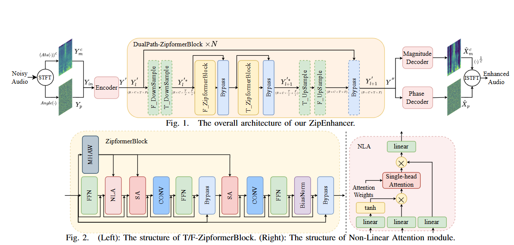
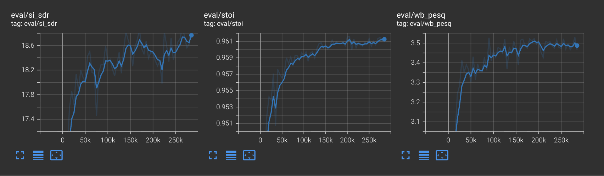
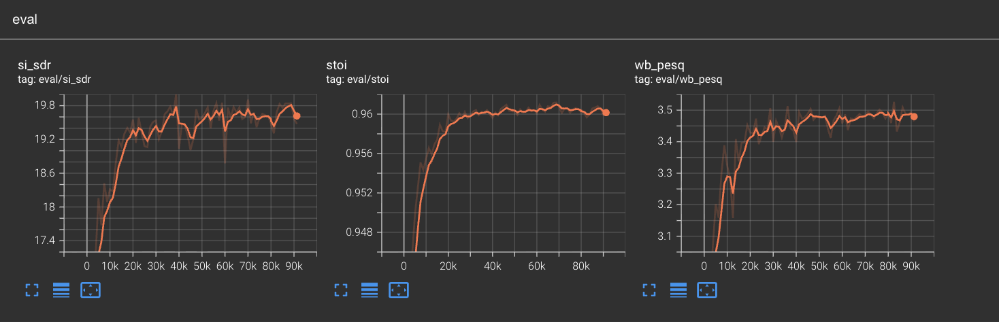
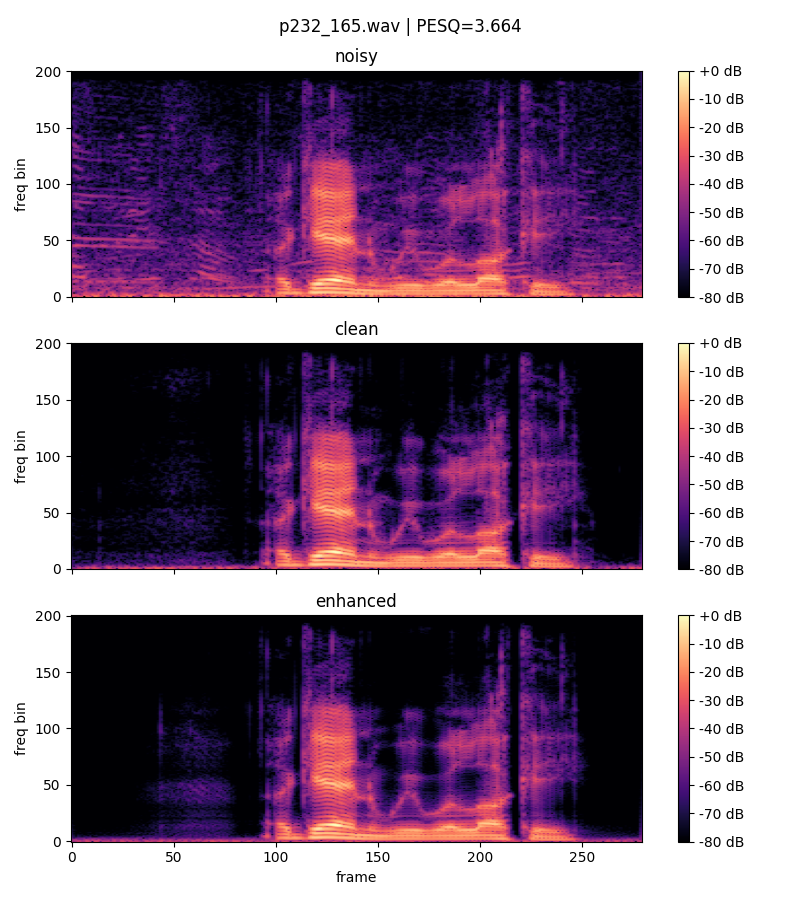

# ZipEnhancer Repro 中文

Language: [English](README.md) | 中文

这是
[ZipEnhancer: Dual-Path Down-Up Sampling-based Zipformer for Monaural Speech
Enhancement](https://arxiv.org/abs/2501.05183)
的非官方 PyTorch 复现与优化推理包。

本仓库可以训练 VoiceBank+DEMAND 上的 ZipEnhancer-S，strict-load 官方
ModelScope 权重，并使用随仓库提供的两个轻量 checkpoint 直接运行语音增强。



*架构总览来自 ZipEnhancer 论文 Fig. 1。*

## 快速开始

```bash
python -m venv .venv
source .venv/bin/activate
pip install -e ".[download]"
```

使用随仓库提供的官方兼容权重，在自带样例 wav 上快速推理：

```bash
bash examples/quick_infer_official.sh
```

使用随仓库提供的 VoiceBank 复现权重，在同一个样例上快速推理：

```bash
bash examples/quick_infer_voicebank.sh
```

仓库不包含数据集；当前版本包含两个轻量 ZipEnhancer-S checkpoint，方便直接做
快速推理。

## 模型卡摘要

- 任务：单通道语音增强 / 声学噪声抑制。
- 输入：16 kHz 单通道 noisy waveform。
- 输出：16 kHz 单通道 enhanced waveform，保持时域 waveform 输出。
- Backbone：ZipEnhancer-S，时频域双路模型，包含幅度/相位解码、FT-Zipformer
  blocks，以及成对 downsample/upsample stacks。
- 参数量：本包内 ZipEnhancer-S 配置约 2.04M 参数。
- 官方模型：ModelScope
  `iic/speech_zipenhancer_ans_multiloss_16k_base`，用于 acoustic noise
  suppression。官方模型卡/论文报告 ZipEnhancer-S 在 DNS2020 上 PESQ 3.69，
  在 VoiceBank+DEMAND 上 PESQ 3.63。
- 许可证边界：本仓库代码使用 MIT；随仓库提供的 checkpoint 保持其原始使用边界，
  使用官方兼容权重时请遵守 ModelScope 官方模型卡及其许可证说明。

## 本仓库贡献

本仓库不是对 ZipEnhancer backbone 每一层的 clean-room 重写。Backbone 基于
社区 PyTorch 抽取版 vendor，以保证可以 strict-load 官方 ModelScope 权重。本
仓库的主要贡献是围绕该 backbone 补齐训练复现系统、兼容性验收、离线推理优化
和开源工程化结构。

- 官方兼容 backbone 工程化：
  vendor 最小 ZipEnhancer-S 社区 PyTorch 实现，封装为
  `zipenhancer_repro.models.backbone`，并验证可 strict-load 官方 ModelScope
  `pytorch_model.bin`。
- VoiceBank+DEMAND 训练复现：
  dataset pipeline、MP-SENet 风格多损失、PESQ-GAN discriminator、
  ScaledAdam/Eden、checkpoint save/resume、TensorBoard 音频/频谱日志、
  全量分块评估。
- 离线推理优化：
  global normalization、Hann overlap-add chunking、relative-position
  no-repeat 显存优化 patch、fp16 Swoosh 兼容 patch，以及数值等价验证。
- 可直接推理的发布形态：
  `weights/` 下提供两个 checkpoint，配套优化推理入口和快速脚本，无需额外下载
  模型文件即可先跑通单文件或目录增强。
- 独立开源包结构：
  `pyproject.toml`、console entry points、configs、scripts、examples、tests、
  MIT license 和第三方来源说明。

## 上游与致谢

本项目是非官方复现与工程整理。使用时请优先引用和致谢原始工作：

- ZipEnhancer 论文：[arXiv:2501.05183](https://arxiv.org/abs/2501.05183)
- 官方 ModelScope 模型：
  [iic/speech_zipenhancer_ans_multiloss_16k_base](https://www.modelscope.cn/models/iic/speech_zipenhancer_ans_multiloss_16k_base/summary)
- 本仓库 vendor backbone 的社区 PyTorch 抽取来源：
  [boreas-l/zipEnhancer](https://github.com/boreas-l/zipEnhancer)
- ScaledAdam/Eden optimizer 组件来自
  [k2-fsa/icefall](https://github.com/k2-fsa/icefall)。
- loss/discriminator 设计参考
  [yxlu-0102/MP-SENet](https://github.com/yxlu-0102/MP-SENet) 风格语音增强训练。

第三方来源说明见 `NOTICE`。随仓库提供的 checkpoint 用于快速复现和推理；
数据集仍由用户自行下载。

## 项目结构

```text
configs/                         复现和推理 YAML 配置
docs/assets/                     README 图片和公开文档资产
examples/                        最小命令行示例和样例 wav
examples/test_datas/             两个 noisy wav，用于快速推理检查
scripts/                         下载和数据准备脚本
weights/                         随仓库提供的官方兼容和复现 checkpoint
src/zipenhancer_repro/
  data/                          VoiceBank+DEMAND dataset loader
  losses/                        MP-SENet 风格 loss 和 PESQ-GAN discriminator
  models/                        对外 backbone wrapper
  optim/                         ScaledAdam/Eden optimizer wrapper
  infer_opt/                     优化离线推理与验证
  vendor/zipenhancer_community/  官方兼容 ZipEnhancer-S backbone
  train.py                       VoiceBank 训练入口
  infer.py                       Chunked overlap-add 推理入口
  evaluate.py                    VoiceBank 评估入口
  verify_official.py             官方权重 strict-load 检查
tests/                           轻量包导入测试
```

## 安装

```bash
python -m venv .venv
source .venv/bin/activate
pip install -e ".[download]"
```

开发与本地验证：

```bash
pip install -e ".[dev,download]"
python -m pytest -q
```

## 数据和权重

准备 VoiceBank+DEMAND 到以下结构：

```text
data/VoiceBank/clean_trainset_28spk_wav
data/VoiceBank/noisy_trainset_28spk_wav
data/VoiceBank/clean_testset_wav
data/VoiceBank/noisy_testset_wav
```

当前仓库包含两个可直接用于推理的 checkpoint：

```text
weights/pytorch_model.bin        官方兼容 ModelScope ZipEnhancer-S 权重
weights/best_00082500.bin        VoiceBank+DEMAND 复现 checkpoint，step 82.5k
```

也可以从 ModelScope 下载或刷新官方权重：

```bash
bash scripts/download_official.sh checkpoints/official
python -m zipenhancer_repro.verify_official \
  --weights checkpoints/official/pytorch_model.bin
```

没有官方权重也可以从零训练：

```bash
python -m zipenhancer_repro.train --config configs/zipenhancer_s.yaml
```

`--init-weights` 只是可选初始化参数，可指向官方权重或已有 checkpoint。

## 训练

```bash
python -m zipenhancer_repro.train --config configs/zipenhancer_s.yaml --smoke
python -m zipenhancer_repro.train --config configs/zipenhancer_s.yaml
python -m zipenhancer_repro.train --config configs/zipenhancer_s.yaml --resume auto
```

TensorBoard：

```bash
tensorboard --logdir outputs/zipenhancer_s/tb
```

### 当前复现进展

目前已在 NVIDIA A10 和 H20 上做过训练和推理实验。代表性结果如下：

| 硬件 | 数据集           |  Step | 评估        | WB-PESQ |   STOI | SI-SDR | 说明                                    |
| ---- | ---------------- | ----: | ----------- | ------: | -----: | -----: | --------------------------------------- |
| A10  | VoiceBank+DEMAND |   90k | 全量 824 句 |  3.5267 | 0.9588 | 18.283 | A10 长跑中观察到的最佳全量评估          |
| A10  | VoiceBank+DEMAND |  285k | 全量 824 句 |  3.4663 | 0.9613 | 18.941 | 长跑最新评估点，不是最佳 checkpoint     |
| H20  | VoiceBank+DEMAND | 82.5k | 全量 824 句 |  3.5265 | 0.9597 | 19.689 | H20 大 batch 复现中观察到的最佳全量评估 |

这些是复现进展，不是官方指标。官方论文中 ZipEnhancer-S 报告 VoiceBank+DEMAND
PESQ 3.63、DNS2020 PESQ 3.69。

VoiceBank 复现实验的 TensorBoard 评估曲线：





## 推理

推荐优先使用 `infer_opt.infer_lite` 优化 full-utterance 推理。快速脚本会先调用
优化推理；如果输入过长导致当前 GPU 显存不足，会自动回退到 chunked overlap-add。

使用随仓库提供的官方兼容权重快速推理：

```bash
bash examples/quick_infer_official.sh \
  examples/test_datas/speech_with_noise.wav \
  outputs/enhanced_official.wav
```

使用随仓库提供的 VoiceBank 复现权重快速推理：

```bash
bash examples/quick_infer_voicebank.sh \
  examples/test_datas/speech_with_noise.wav \
  outputs/enhanced_voicebank.wav
```

需要直接控制 full-utterance 优化路径时，可以调用原始入口：

```bash
python -m zipenhancer_repro.infer_opt.infer_lite \
  --ckpt weights/pytorch_model.bin \
  --input examples/test_datas/speech_with_noise.wav \
  --output outputs/enhanced_lite.wav
```

用于官方权重对齐检查、更长语音和目录处理的 chunked overlap-add 推理仍然保留：

```bash
python -m zipenhancer_repro.infer \
  --ckpt weights/pytorch_model.bin \
  --input examples/test_datas \
  --output outputs/enhanced_official_chunked
```

优化 full-utterance 推理：

```bash
python -m zipenhancer_repro.infer_opt.verify_numeric \
  --ckpt weights/pytorch_model.bin

python -m zipenhancer_repro.infer_opt.infer_lite \
  --ckpt weights/pytorch_model.bin \
  --input examples/test_datas/speech_with_noise.wav \
  --output enhanced.wav
```

## VoiceBank 推理效果

以下结果均在 VoiceBank test 824 句上评估，峰值显存基于 NVIDIA A10。`infer_opt`
使用 global norm、Hann overlap-add 和 relative-position no-repeat patch。

### 官方 DNS2020 权重，不同推理算法

| Cell             | Dtype | Window | 拼接     | 归一化    | 触发   | WB-PESQ |   STOI | SI-SDR | Peak MB |    RTF |
| ---------------- | ----- | -----: | -------- | --------- | ------ | ------: | -----: | -----: | ------: | -----: |
| official 2s      | fp32  |     2s | 硬接     | per chunk | >6s    |  3.2836 | 0.9537 | 19.528 |  5603.2 | 0.0623 |
| infer_opt 2s     | fp32  |     2s | Hann-OLA | global    | always |  3.4124 | 0.9598 | 19.937 |   746.5 | 0.1006 |
| infer_opt 2s     | fp16  |     2s | Hann-OLA | global    | always |  3.4121 | 0.9598 | 19.938 |   378.6 | 0.0736 |
| infer_opt 4s     | fp16  |     4s | Hann-OLA | global    | always |  3.4278 | 0.9613 | 20.011 |  1377.4 | 0.0458 |
| 4s 硬接 baseline | fp16  |     4s | 硬接     | per chunk | >8s    |  2.6514 | 0.8939 | 12.741 |  4270.3 | 0.0593 |

官方权重的推荐默认推理配置是 `infer_opt 2s fp16`：PESQ 与 fp32 基本等价，
峰值显存约 379 MB。

### 官方权重与 VoiceBank 复现权重

| 权重                 | 算法                  |       N | OOM | WB-PESQ |   STOI | SI-SDR | Peak MB |    RTF |
| -------------------- | --------------------- | ------: | --: | ------: | -----: | -----: | ------: | -----: |
| official DNS2020     | infer_opt fp16        | 824/824 |   0 |  3.4121 | 0.9598 | 19.938 |   378.6 | 0.0751 |
| official DNS2020     | ModelScope-style fp32 | 824/824 |   0 |  3.2836 | 0.9537 | 19.528 |  5603.2 | 0.0617 |
| reproduced VoiceBank | infer_opt fp16        | 824/824 |   0 |  3.5128 | 0.9602 | 19.784 |   378.6 | 0.0727 |
| reproduced VoiceBank | ModelScope-style fp32 | 824/824 |   0 |  3.5284 | 0.9601 | 19.876 |  5603.2 | 0.0591 |

复现评估中的 noisy / clean / enhanced 频谱示例：



## 本地发布验收

```bash
python -m pytest -q
python -m zipenhancer_repro.verify_official --weights weights/pytorch_model.bin
CUDA_VISIBLE_DEVICES=0 python -m zipenhancer_repro.train --config configs/zipenhancer_s.yaml --smoke
python -m zipenhancer_repro.infer_opt.verify_numeric --ckpt weights/pytorch_model.bin --seconds 1.0
```

## 范围

首批公开包暂不包含内部实验记录和仍在推进的拓展方向研究。后续拓展完成并验证后，
会继续更新放出。vendor 代码保持最小化，并在 `NOTICE` 中说明来源。
